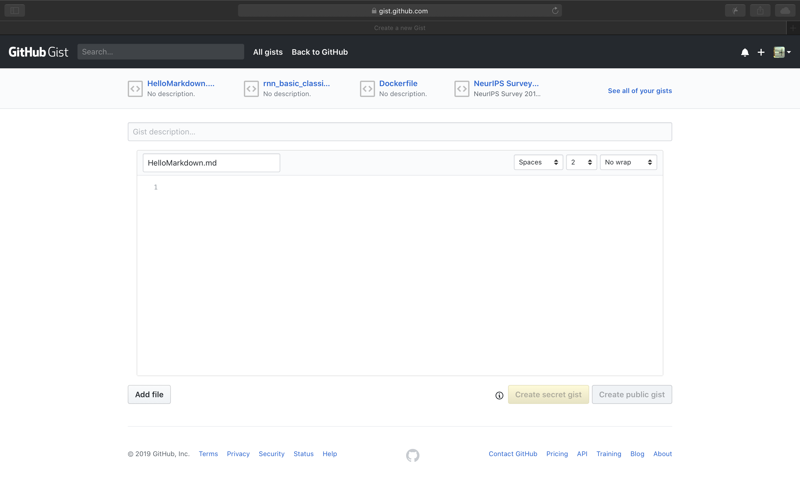

# Markdown

GitHubなどでコードを見ていると、`README.md` というような形式のファイルをよく見かけると思います。これは、Markdownと呼ばれるマークアップ言語で記述されたファイルのことです。ここでは、Markdownの基本的な文法について解説します。

## 見出し

WordやPagesでは、該当箇所を選択して見出し・小見出しを設定しますが、Markdowndでは、`#` で指定します。  
実際に試してみましょう。[https://gist.github.com/](https://gist.github.com/) にアクセスして、 `HelloMarkdown.md` と言うファイル名を付け、次の文を入力してみてください。



```text
# 見出し1
## 見出し2
### 見出し3
#### 見出し4
##### 見出し5
###### 見出し6
```

保存すると、対応する見出しが表示されるはずです。

## 改行

Markdownの改行は少し独特です。次の文を先程の `HelloMarkdown.md` に追記してみてください。

```text
hello,
world
```

残念ながら改行されません。Markdownで文を改行するには、**半角スペースを2回**末尾に入力してあげなくてはなりません。

```text
hello,  
world
```

これで出来たはずです。


なぜ、README は大文字なのか？

READMEが大文字なのはUnixユーザの文化的理由からです。

Unixユーザが中心となって育んできた考え方に「Unix哲学」というものがあります。この文化圏において、特に注意を引きたい場合は、大文字で書くという伝統があります。その為、真っ先に読んで欲しいファイルであるREADMEは大文字で書かれます。

Unix哲学について詳しく知りたい場合は「[UNIXという考え方　その設計思想と哲学](https://www.amazon.co.jp/UNIXという考え方―その設計思想と哲学-Mike-Gancarz/dp/4274064069)」 を参照してください。


## コードブロック

世の中には常軌を逸した行動を平気で取る人が沢山います。例えば、コマンド文をWord文章に書くために態々スクリーンショットを撮り、それを文に貼り付けると言う異常行動等です。Workの場合は 等幅フォントを使うべきですが、Markdownでは、以下のように入力する事で、コードのシンタックスハイライトまで勝手にやってくれます。

```text
```言語の名前
イカしたコード
```
```

これじゃよく分からない？じゃあ、もっと具体的な例を見てみましょう。

```text
```python
import numpy as np

class Something:
    def __init__(self):
        self.foo = np.arange(10)
    
    def bar(self):
        return self.foo
        

something = Something()
print(something.bar)
```
```

これで、分かるはず。

また、`このように` 文中に書きたい場合は、**バッククオート\( \` \)** で単語を囲めばOKです。

```text
 `このように` 
```

## リスト

Markdownでは **箇条書き** と **番号付きリスト** そして**チェックリスト** の3種類があります。

### 箇条書き

箇条書きリストはアスタリスクとTab で表現します。

```text
* リスト1
    * リスト1_1
    * リスト1_2
    * リスト1_3
* リスト2
    * リスト2_1
    * リスト2_2
    * リスト2_3
```

### 番号付きリスト

番号付きリストは少し特殊です。普通に手打ちで番号を割り振ってもいいのですが、文頭に `1.`  とするだけで自動的に番号が割り振られます。

```text
1. リスト1
    1. リスト1_1
    1. リスト1_2
    1. リスト1_3
1. リスト2
    1. リスト2_1
    1. リスト2_2
    1. リスト2_3
```

### チェックリスト

Markdownでは次のようなチェックリストを作ることが可能です。

* [ ] test1
* [x] test2

これを作るには次のようなコードを書きます。

```text
* [ ] test1
* [x] test2
```

`x` がついている箇所がチェックがついている点です。


## リンクと画像

### リンク

Markdownでリンクを貼るには次のように書きます。

```text
[表示する文章](url)
```

具体例

```text
[Googleへのリンク](https://www.google.co.jp)
```

### 画像

画像の貼り付けはリンクを貼る方法とほとんど同じです。

```text

```

リンクの前に感嘆符を付けることで画像と認識させることが可能です。

具体例

```text

```

今回の例では、外部サイトの画像を参照していますが、ローカルマシンのフルパスを指定することも可能です。

## 引用

何かしらを引用した際、それを分かりやすく表示することができます。  
具体的には次のように表示します。

> あのイーハトーヴォのすきとおった風、夏でも底に冷たさをもつ青いそら、うつくしい森で飾られたモリーオ市、郊外のぎらぎらひかる草の波。
>
> ポラーノの広場 宮沢賢治 より引用

これは、次のように記述します。

```text
> あのイーハトーヴォのすきとおった風、夏でも底に冷たさをもつ青いそら、
> うつくしい森で飾られたモリーオ市、郊外のぎらぎらひかる草の波。
> ポラーノの広場 宮沢賢治 より引用
```

多重引用は次のようにします。

```text
> 引用
> 引用
>> 多重引用 1
>>> 多重引用 2
>> 多重引用 1
> 引用
```

> 引用
>
> 引用
>
> > 多重引用 1
> >
> > > 多重引用 2
> >
> > 多重引用 1
>
> 引用

## 強調

強調にはいくつか種類があります。

### 太文字

太文字は単語を `*` 2つで囲みます。

```text
**bold**
```

**bold**

### イタリック

イタリック体にするには `_` 1つで囲みます

```text
_italic_
```

_italic_

### 取り消し線

取り消し線は `~` 1つで単語を囲みます。

```text
~strikethrough~
```

~~strikethrough~~

もちろん全部載せできます。

```text
~**_test_**~
```

~~test~~


### 

### 


